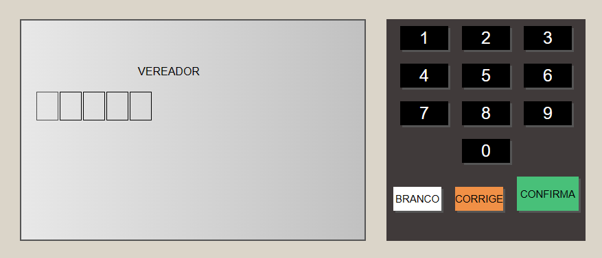

# 📂 Projeto Urna Eletrônica

## 📃 Projeto desenvolvido durante curso de Javascript na plataforma B7Web com objetivo de simular o uso de uma urna eletrônica brasileira e seus recursos para escolha de candidato a prefeito e vereador

 

## 🚀 Tecnologias

- HTML
- CSS
- JavaScript
- Git e Github

 

## 💻 Projeto
> Frontend da aplicação 📸

  

[Acessar o projeto](https://wsawebmaster.github.io/js-urna-eletronica/)

 

Para visualizar a animação, simule o voto em um dos candidatos abaixo: 

Vereador: 38111 ou 77222 
Prefeito: 84 ou 99

---
---
## 📧 Contato
[LinkedIn](https://www.linkedin.com/in/wsawebmaster/)

wsawebmaster@yahoo.com.br
